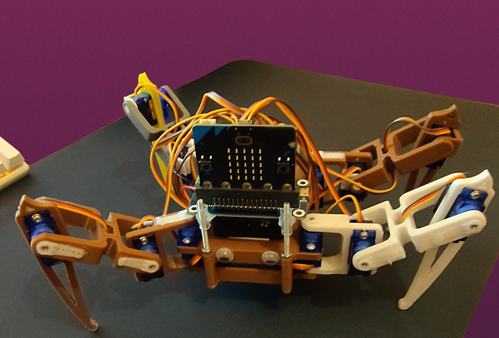

# Quadruped spider robot for Microbit 

## Makecode Library
Open [MakeCode for micro:bit](https://makecode.microbit.org),
create a project, click the gearwheel → **Extensions**, and paste repository's GitHub URL

https://github.com/tbzcode/pxt-quadspider

